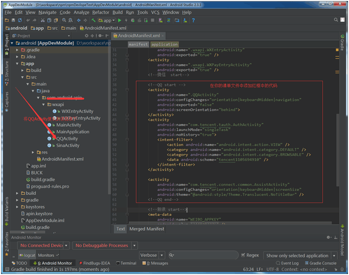
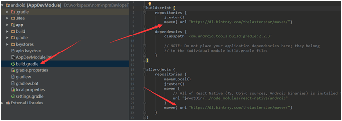
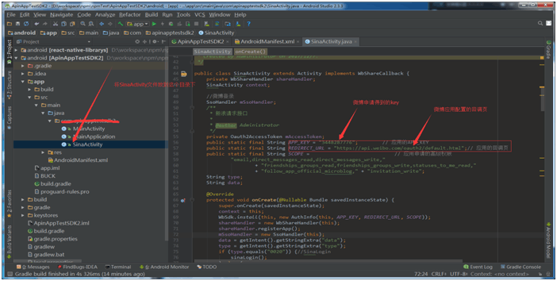

---
title:安卓相关配置

---
###  一 新建RN项目
```
$  react-native  init  AppName(创建一个新工程)
$  cd AppName                  （进入根目录文件下）
$  npm i react-native-librarys  （下载包进行依赖）
$  react-native link react-native-librarys（修改安卓ios原生配置，如果自动link失败，请手动link）
```
--- 
### 二 集成QQ
```
1 在主工程中的src/main/java/***/ 下新建一个且名字为QQActivity 的类，继承Activity；复制其代码到相应的位置，并且将此处改为你申请到的腾讯APP_ID;
（可以直接将该类复制到与MainActivity同级目录下  注：该类名必须为QQActivity）如图所示
```


```
2 修改[QQ]的APP_ID  该APP_ID是在腾讯开发者平台申请得到的，该APP_ID与工程的包名有关，如图：
```


---
### 三 集成新浪
```
1 使用AS 打开android工程-->
打开project的build.gradle文件-->
buildscript {
    repositories {
        jcenter()
        maven{ url "https://dl.bintray.com/thelasterstar/maven/"}//添加这行代码
    }
    dependencies {
        classpath 'com.android.tools.build:gradle:2.2.3'
    }
}
打开app的builed.gradle文件-->
allprojects {
    repositories {
        mavenLocal()
        jcenter()
        maven {
            url "$rootDir/../node_modules/react-native/android"
        }
        maven{ url "https://dl.bintray.com/thelasterstar/maven/"}//添加这行代码
    }
}
如图所示
```

```
2 打开app的build.gradle文件-->
dependencies {
    compile project(':react-native-librarys')
    compile fileTree(dir: "libs", include: ["*.jar"])
    compile "com.android.support:appcompat-v7:23.0.1"
    compile "com.facebook.react:react-native:+"  // From node_modules
    compile 'com.sina.weibo.sdk:core:2.0.3:openDefaultRelease@aar'//添加这行代码
}
然后点击右上角的Sync Now 进行下载编译
如图所示
```


```
3 复制文件[SinaActivity.class] 到与MainActivity同一目录下， 并且修改SinaActivity中的APP_KEY 
即是你在新浪开发者平台申请的key值 REDIRECT_URL在新浪的设置页设置如图：
如图：
```

```
4 在androidManifest.xml中添加
<!--新浪 start-->
<meta-data
    android:name="WEIBO_APPKEY"
    android:value="******" />//value为你申请得到的新浪APP_ID
<activity
    android:launchMode="singleTask"
    android:name=".SinaActivity"
    android:configChanges="keyboardHidden|orientation"
    android:screenOrientation="portrait">
</activity>
<!--新浪 end-->
如图所示

```


---
### 三  集成微信
```
1 在主工程目录下（src/mian/***包名/wxapi）新建wxapi文件夹 
  在wxapi文件夹下新建 WXEntryActivity 和 WXPayEntryActivity 两个类继承Activity且重写onCreate方法
  在这两个类的onCreate方法中添加SuperModule.handleIntent(getIntent());finish();
  @Override
    protected void onCreate(Bundle savedInstanceState) {
    super.onCreate(savedInstanceState);
    SuperModule.handleIntent(getIntent());
    finish();
}

  
  如图所示

```

```
2 别忘记在AndroidManifest.xml中注册这两个类
<activity
    android:name=".wxapi.WXEntryActivity"
    android:exported="true" />
<activity
    android:name=".wxapi.WXPayEntryActivity"
    android:exported="true" />
```


