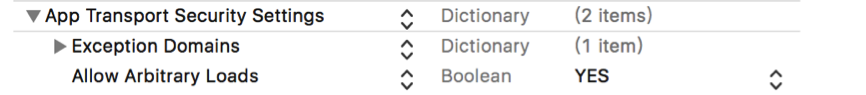
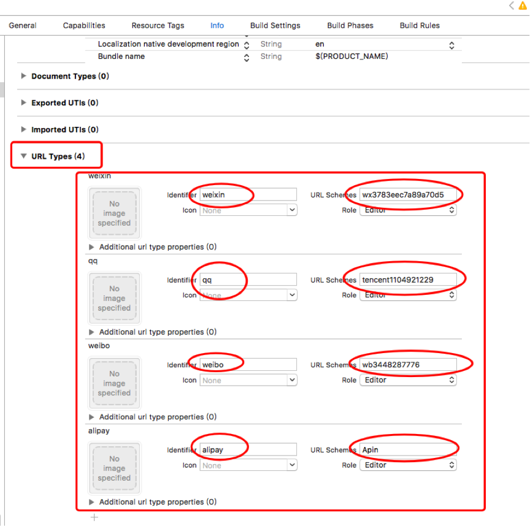
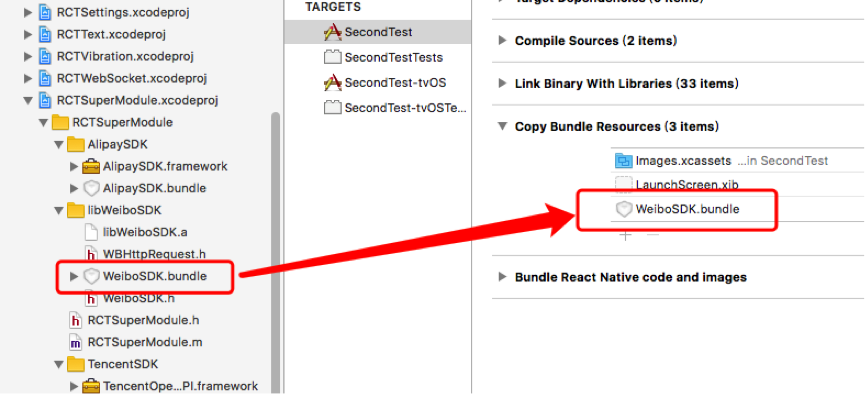

### 一、新建一个RN项目，引入react-native-librarys  

```
$ npm install react-native-librarys –save  
$ react-native link  
```
### 二、iOS9引入了新特性App Transport Security (ATS)，需要在info.plist里修改成下图，把这个属性选成YES



### 三、需要在AppDelegate加入以下代码用于接收回调：

```
#import "RCTSuperModule.h"  
  
- (BOOL)application:(UIApplication *)application handleOpenURL:  
(NSURL *)url {  
  return [RCTSuperModule handleOpenURL:url];  
}  
  
//9.0之前接口  
- (BOOL)application:(UIApplication *)application  
    		  openURL:(NSURL *)url  
  sourceApplication:(NSString *)sourceApplication  
         annotation:(id)annotation {  
  return [RCTSuperModule handleOpenURL:url];  
}  
  
//9.0之后新接口  
- (BOOL)application:(UIApplication *)app openURL:(NSURL *)url  
  options:(NSDictionary<UIApplicationOpenURLOptionsKey,id>  
  		*)options    {  
  return [RCTSuperModule handleOpenURL:url];  
}       
      
```
### 四、分享，登录，支付需要特殊配置
#### 1. 微信
##### 1.1添加白名单
在项目中的info.plist中加入应用白名单，右键info.plist选择source code打开(plist具体设置在Build Setting -> Packaging -> Info.plist File可获取plist路径) 请根据选择的平台对以下配置进行缩减：

```
<key>LSApplicationQueriesSchemes</key>  
<array>  
<!-- 微信 URL Scheme 白名单-->  
<string>wechat</string>  
<string>weixin</string>  
<!-- 新浪微博 URL Scheme 白名单-->  
<string>sinaweibohd</string>  
<string>sinaweibo</string>  
<string>sinaweibosso</string>  
<string>weibosdk</string>  
<string>weibosdk2.5</string>  
<!-- QQ、Qzone URL Scheme 白名单-->  
<string>mqqapi</string>  
<string>mqq</string>  
<string>mqqOpensdkSSoLogin</string>  
<string>mqqconnect</string>  
<string>mqqopensdkdataline</string>  
<string>mqqopensdkgrouptribeshare</string>  
<string>mqqopensdkfriend</string>  
<string>mqqopensdkapi</string>  
<string>mqqopensdkapiV2</string>  
<string>mqqopensdkapiV3</string>  
<string>mqzoneopensdk</string>  
<string>wtloginmqq</string>  
<string>wtloginmqq2</string>  
<string>mqqwpa</string>  
<string>mqzone</string>  
<string>mqzonev2</string>  
<string>mqzoneshare</string>  
<string>wtloginqzone</string>  
<string>mqzonewx</string>  
<string>mqzoneopensdkapiV2</string>  
<string>mqzoneopensdkapi19</string>  
<string>mqzoneopensdkapi</string>  
<string>mqzoneopensdk</string>  
</array>  

```
##### 1.2添加URL Types
设置 URL Scheme URL Scheme是通过系统找到并跳转对应app的设置，通过向项目中的info.plist文件中加入URL types可使用第三方平台所注册的appkey信息向系统注册你的app，当跳转到第三方应用授权或分享后，可直接跳转回你的app。



或者直接添加到info.plist文件

```
<key>CFBundleURLTypes</key>  
	<array>  
		<dict>  
			<key>CFBundleTypeRole</key>  
			<string>Editor</string>  
			<key>CFBundleURLName</key>  
			<string>weixin</string>  
			<key>CFBundleURLSchemes</key>  
			<array>  
				<string>wx3783eec7a89a70d5</string>  
			</array>  
		</dict>  
		<dict>  
			<key>CFBundleTypeRole</key>  
			<string>Editor</string>  
			<key>CFBundleURLName</key>  
			<string>qq</string>  
			<key>CFBundleURLSchemes</key>  
			<array>  
				<string>tencent1104921229</string>  
			</array>  
		</dict>  
		<dict>  
			<key>CFBundleTypeRole</key>  
			<string>Editor</string>  
			<key>CFBundleURLName</key>  
			<string>weibo</string>  
			<key>CFBundleURLSchemes</key>  
			<array>  
				<string>wb3448287776</string>  
			</array>  
		</dict>  
		<dict>  
			<key>CFBundleTypeRole</key>  
			<string>Editor</string>  
			<key>CFBundleURLName</key>  
			<string>alipay</string>  
			<key>CFBundleURLSchemes</key>  
			<array>  
				<string>Apin</string>  
			</array>  
		</dict>  
	</array>   
	
```

附：各平台配置URL Schemes规则 

| 平台 | 格式 | 举例 | 备注 |
| --- | --- | --- | --- |
| 微信 | 微信appKey | wx3783eec7a89a70d5 | |
| QQ/Qzone | 需要添加两项URL Scheme: 1、"tencent"+腾讯QQ互联应用appID  2、"QQ"+腾讯QQ互联应用appID转换成十六进制(不足8位前面补0) |如 appID:1104921229  1、tencent1104921229  2、QQ41dbc28d |  |
|新浪微博 | "wb"+新浪appKey | wb3448287776| |
|支付宝 | "ap"+appID 自己定义也可以 | ap2015111700822536 |这里配置的URL Schemes的值(Apin)应与调用支付宝支付方法传入的schemeStr一致 |


#### 2. QQ
##### 2.1添加白名单（见微信配置）
##### 2.2添加URL Types（见微信配置）
#### 3. 微博
##### 3.1添加白名单（见微信配置） 
##### 3.2添加URL Types（见微信配置）
##### 3.3Target -> Build Phase -> Copy Bundle Resources 



#### 4. 支付宝
##### 4.1添加URL Types（见微信配置） 
(注意：这里配置的URL Schemes的值(Apin)应与调用支付宝支付方法传入的schemeStr一致)
### 五、在RN项目里如何调用SDK

```
import {SuperModule} from 'react-native-librarys';  
  
//微信注册（开始时就调用）  
SuperModule.registerWeChat('wx3783eec7a89a70d5').then((resp)=>{  
	console.log("result...微信注册成功" + JSON.stringify(resp));  
}).catch((resp)=>{  
	console.log("result...微信注册失败" + JSON.stringify(resp));  
});  
  
//图文链接分享  
const shareJson = {  
	type: 'news',  
	title: '我是分享标题',  
	description: '我是分享描述',  
	webpageUrl: 'http://baidu.com',  
	imageUrl:'http://dev.umeng.com/images/tab2_1.png'  
};  
  
//仅图片分享  
const shareJson = {  
	type: 'imageFile',    
	imageUrl:'http://dev.umeng.com/images/tab2_1.png'  
};  
  
//微信分享  
SuperModule.shareToSession(shareJson).then((resp)=>{  
	console.log("result...微信分享链接到好友成功" + JSON.stringify(resp));  
}).catch((resp)=>{  
	console.log("result...微信分享链接到好友失败" + JSON.stringify(resp));  
});  
  
//微信注册（开始时就调用）  
SuperModule.registerWeChat(appId).then().catch()  
  
//微信分享图片文字链接到好友  
SuperModule.shareToSession(shareJson).then().catch()  
  
//微信分享图片文字链接到朋友圈  
SuperModule.shareToTimeline(shareJson).then().catch()  
  
//微信登录  
SuperModule.weChatLogin().then().catch()  
  
//微信支付  
const payJson = {  
	partnerId: '商家向财付通申请的商家id',  
	prepayId: '预支付订单',  
	nonceStr: '随机串，防重发',  
	timeStamp:'时间戳，防重发',  
	packageValue:'商家根据财付通文档填写的数据和签名',  
	sign:'商家根据微信开放平台文档对数据做的签名'  
};  
SuperModule.weChatPay(payJson).then().catch()  
  
//QQ注册（开始时就调用）  
SuperModule.registerQQ(appId).then().catch()  
  
//QQ分享 分享好友 分享的是链接，文字描述，网络图片  
SuperModule.qqShare(shareJson).then().catch()  
  
//QQ授权登录  
SuperModule.qqLogin().then().catch()  
  
//新浪微博注册（开始时就调用）  
SuperModule.registerWeibo(appId).then().catch()  
  
//新浪微博分享 新浪微博分享 分享图文介绍连接  
SuperModule.sinaShare(shareJson).then().catch()  
  
//微博授权登录  
SuperModule.sinaLogin().then().catch()  
  
/**  
 *  支付宝支付(后端加签)  
 *  @param orderStr       订单信息  
 *  @param schemeStr      调用支付的app注册在info.plist中的scheme  
*/  
const payJson = {  
	orderStr: '订单信息',  
	schemeStr: 'Apin',  
};   
SuperModule.aliPay(payJson).then().catch()   

```  

